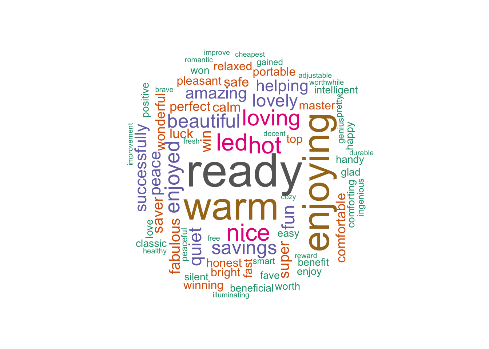

# savingSessions

Analysis of UK NG-ESO electricity use during [Demand Flexibility Service](https://twitter.com/hashtag/DemandFlexibilityService)/saving sessions. Best viewed at https://dataknut.github.io/savingSessions

## Integrated anlaysis

 * integrated [electricity demand and twitter analysis](dfsReport.html)
 
## Tweet analysis:

No longer updated - see integrated [electricity demand and twitter analysis](dfsReport.html)

 * #savingSession hashtag [tweet analysis](savingSessionsTweets.html) - includes positive & negative sentiment analysis like these: 
    
    
 * #DemandFlexibilityService [tweet analysis](demandFlexibilityServiceTweets.html) - also includes positive & negative sentiment analysis
 
## Energy savings analysis:

 * #savingSession Session 1 [energy saving analysis](savingSessionsEnergy.html) using GB generation mix data - no longer updated, see integrated [electricity demand and twitter analysis](dfsReport.html)
 * analysis of #savingSession [smart meter data](https://dataknut.github.io/octopusAPI/energyReport.html#523_Winter_2022_SavingsSessions) from (just) one dwelling :- chez nous :-)
